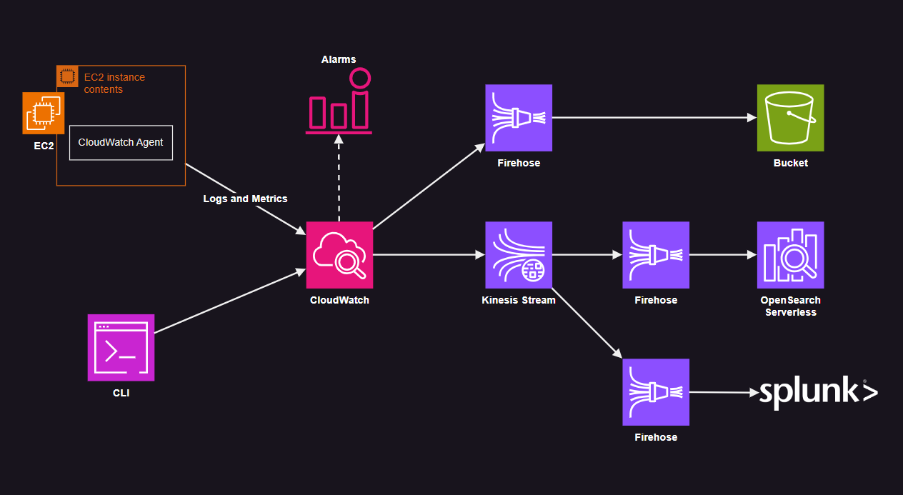

# AWS CloudWatch Logs, Metrics & Subscriptions

CloudWatch Logs subscription filters with Kinesis and several destinations.

The project also includes Guest OS metrics collection with alarms.



Create the resources:

```sh
terraform -chdir="aws" init
terraform -chdir="aws" apply -auto-approve
```

Make sure that the agent has been installed:

```sh
cloud-init status
systemctl status amazon-cloudwatch-agent
```

To complete the OpenSearch Serverless setup, connect and create a public Access Policy via the [Console](https://us-east-2.console.aws.amazon.com/aos/home?region=us-east-2#opensearch/collections/prod-logs). (This seems not available via Terraform as of now)

Send static sample logs to the stream:

```sh
aws logs put-log-events --log-group-name prod-logs --log-stream-name trunk --log-events file://events.json
```

Send dynamic timestamped logs:

```sh
bash putLogEvents.sh INFO
bash putLogEvents.sh ERROR
```

To subscribe only to specific logging patterns, edit the filter pattern:

```terraform
subscription_filter_pattern = ""
```

💡 Additional Firehose configurations that are available:

- Data transformation (via Lambda)
- Record format conversion (Parquet, ORC)
- Bucket error prefix
- Dynamic partitioning
- Backup
- Server-side encryption (SSE)
- Destination error logs (CloudWatch)

## Logging & Metrics from EC2

The `amazon-cloudwatch-agent` package will be installed via user data.

This will the default configuration with `Basic` predefined [metrics set][1] and the root `/` disk:

```json
{
  "agent": {
    "metrics_collection_interval": 60,
    "run_as_user": "root"
  },
  "metrics": {
    "aggregation_dimensions": [
      [
        "InstanceId"
      ]
    ],
    "append_dimensions": {
      "AutoScalingGroupName": "${aws:AutoScalingGroupName}",
      "ImageId": "${aws:ImageId}",
      "InstanceId": "${aws:InstanceId}",
      "InstanceType": "${aws:InstanceType}"
    },
    "metrics_collected": {
      "disk": {
        "measurement": [
          "used_percent"
        ],
        "metrics_collection_interval": 60,
        "resources": [
          "/"
        ]
      },
      "mem": {
        "measurement": [
          "mem_used_percent"
        ],
        "metrics_collection_interval": 60
      }
    }
  }
}
```

For other options, check on how to [install the agent][2].

Download the Go app binary:

```sh
curl -L https://github.com/epomatti/aws-cloudwatch-subscriptions/releases/download/v0.0.1/main.so -o main.so
```

Start the app and call the `/info` and `/err` endpoints fro simulating log sync to CloudWatch.

## Local code

From the logging app root:

```sh
go get
go run .
```

Testing the outputs:

```sh
curl localhost:8080/info
curl localhost:8080/err
```

From the logging app root, build it: `./build.sh`

[1]: https://docs.aws.amazon.com/AmazonCloudWatch/latest/monitoring/create-cloudwatch-agent-configuration-file-wizard.html
[2]: https://docs.aws.amazon.com/AmazonCloudWatch/latest/monitoring/install-CloudWatch-Agent-on-EC2-Instance-fleet.html
